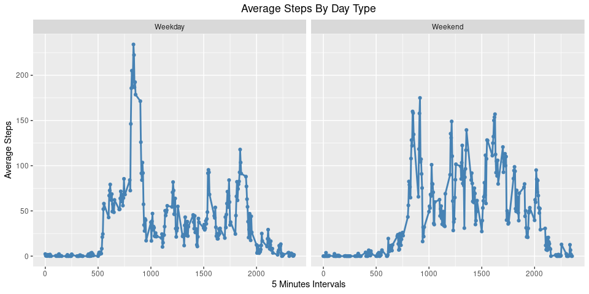

# Overview

This markdown page is used to illustrate the "stream of text and code" functionality used to present reproducible code to a wider audience, and will be reviewed by peers that it fits the submission requirements. 

## Loading and preprocessing the data

### First load the libraries


```r
## First specify the packages of interest
packages = c("RCurl", "data.table", "dplyr", "ggplot2", "ggpubr", "mice", "VIM")

## Now load or install&load all
package.check <- lapply(
  packages,
  FUN = function(x) {
    if (!require(x, character.only = TRUE)) {
      install.packages(x, dependencies = TRUE)
      library(x, character.only = TRUE)
    }
  }
)
```

###  1. Code for reading in the dataset and/or processing the data


```r
# Create a directory to put data file in
if(!file.exists("./data")) {
  dir.create("./data")
}
# Download the data zip file (commented out for expedience)
# download.file( "https://d396qusza40orc.cloudfront.net/repdata%2Fdata%2Factivity.zip", destfile=".activity.zip", method="curl")

# Unzip the zip file to the directory
unzip(zipfile="./activity.zip", exdir="./data")
```

### Load data into a data table


```r
# load basic data table
personal_activity_dft <- fread("./data/activity.csv", na.strings=c("NA"))
# set data field to type Date
personal_activity_dft$date <- as.Date(personal_activity_dft$date)

# Get first five rows
head(personal_activity_dft, n=5)
```

```
##    steps       date interval
## 1:    NA 2012-10-01        0
## 2:    NA 2012-10-01        5
## 3:    NA 2012-10-01       10
## 4:    NA 2012-10-01       15
## 5:    NA 2012-10-01       20
```

### Create separate dataframe that removes NA values


```r
# clear out NA values and make steps numeric
personal_activity_dft_nona <- personal_activity_dft[!is.na(personal_activity_dft$steps)]
personal_activity_dft_nona$steps <- as.numeric(personal_activity_dft_nona$steps)

# Get first five rows
head(personal_activity_dft_nona, n=5)
```

```
##    steps       date interval
## 1:     0 2012-10-02        0
## 2:     0 2012-10-02        5
## 3:     0 2012-10-02       10
## 4:     0 2012-10-02       15
## 5:     0 2012-10-02       20
```

## What is mean total number of steps taken per day?

### 2. Histogram of the total number of steps taken each day


```r
# step histogram by date
ggplot(personal_activity_dft_nona, aes(x=date,  weights=steps)) +
  geom_histogram(color="black", fill="green", bins = 53) +
  ylab("Steps Per Day") + 
  xlab("Date of Measurement") +
  ggtitle("Steps Per Day By Date") +
  theme(plot.title = element_text(hjust = 0.5))
```

<!-- -->

### 3. Mean and median number of steps taken each day


```r
# find mean and median via summary
steps_per_day_df <- aggregate(list(sumsteps=personal_activity_dft_nona$steps),by=list(date=personal_activity_dft_nona$date),FUN=sum)
summary <- summary(steps_per_day_df$sumsteps)

# print them out
print(paste("Mean number of steps: ", summary[4], sep=""))
```

```
## [1] "Mean number of steps: 10766.1886792453"
```

```r
print(paste("Median number of steps: ", summary[3], sep=""))
```

```
## [1] "Median number of steps: 10765"
```

## What is the average daily activity pattern?

### 4. Time series plot of the average number of steps taken


```r
# get plot with average horizontal line, smooth average by time and actual points
ggplot(data=steps_per_day_df, aes(x=date, y=sumsteps, group=1)) +
  geom_line(color="grey") +
  geom_point(color="grey") + 
  geom_smooth(method = "loess", color="grey") +
  ylab("Steps Per Day") +
  xlab("Date") +
  ggtitle("Time Series Plot of the Average Number of Steps Taken") +
  theme(plot.title = element_text(hjust = 0.5)) +
  geom_hline(yintercept = mean(steps_per_day_df$sumsteps), color="green")
```

<!-- -->

### 5. The 5-minute interval that, on average, contains the maximum number of steps  


```r
# find the top interval
top_interval <- personal_activity_dft_nona %>%
  group_by(interval) %>% #group by name
  summarise(avg_steps=mean(steps)) %>% #create variabele "avg_score" which hold the mean of scores for each name
  top_n(1) %>% #select the top 2, you can change it to 10 with your real data 
  arrange(desc(avg_steps)) #arrange in a descending fashion to get the names with highest avg_score

print(paste("The five minute interval with the maximum number of steps was interval ", top_interval[1,1], " at ", top_interval[1,2], " steps", sep=""))
```

```
## [1] "The five minute interval with the maximum number of steps was interval 835 at 206.169811320755 steps"
```
  
## Imputing missing values

### 6. Code to describe and show a strategy for imputing missing data

***Reference:*** [Imputing Missing Data with R; MICE package](https://datascienceplus.com/imputing-missing-data-with-r-mice-package/)

There are multiple rows in the activity data that have NA values in the number of steps. The way to impute data depends on why the data is missing. There are two types of missing data:

- MCAR: missing completely at random. This is the desirable scenario in case of missing data.
- MNAR: missing not at random. Missing not at random data is a more serious issue and in this case it might be wise to check the data gathering process further and try to understand why the information is missing. For instance, if most of the people in a survey did not answer a certain question, why did they do that? Was the question unclear?

We are assuming this is MCAR data. For this the mice() function takes care of the imputing process. The pmm method is used, as it is the first one mentioned, and it is difficult to discern if there is a better one


```r
# Create the imputed data set
mice_imputes <- mice(personal_activity_dft, m=5, meth="pmm")
# Create the imputed dataframe from the dataset
personal_activity_dft_impute <- mice::complete(mice_imputes,5)
```


```r
# Get first five rows
head(personal_activity_dft_impute, n=5)
```

```
##   steps       date interval
## 1     0 2012-10-01        0
## 2    47 2012-10-01        5
## 3     0 2012-10-01       10
## 4     0 2012-10-01       15
## 5     0 2012-10-01       20
```

### 7. Histogram of the total number of steps taken each day after missing values are imputed, compared with original


```r
# create original plot with NA values removed
nonaplot <- ggplot(personal_activity_dft_nona, aes(x=date,  weights=steps)) +
  geom_histogram(color="black", fill="green", bins = 53) +
  ylab("Steps Per Day") + 
  xlab("Date of Measurement") +
  ggtitle("Histogram Steps/Day, NA Remove") +
  theme(plot.title = element_text(hjust = 0.5))

# create new plot with imputed values included
imputeplot <- ggplot(personal_activity_dft_impute, aes(x=date,  weights=steps)) +
  geom_histogram(color="black", fill="green", bins = 53) +
  ylab("Steps Per Day") + 
  xlab("Date of Measurement") +
  ggtitle("Histogram Steps/Day, Imputed") +
  theme(plot.title = element_text(hjust = 0.5))

# print out both plots
ggarrange(nonaplot, imputeplot, ncol = 2, labels = c("A", "B")) # Second row with box and dot plots
```

<!-- -->


## Are there differences in activity patterns between weekdays and weekends?

### 8. Panel plot comparing the average number of steps taken per 5-minute interval across weekdays and weekends


```r
# create a vector of weekends
weekenddays <- c('Saturday', 'Sunday')
# create column marking which date is weekend or weekday
personal_activity_dft_nona$daytype <- factor(ifelse((weekdays(personal_activity_dft_nona$date) %in% weekenddays) == TRUE, 'Weekend', 'Weekday'))

# Divide by weekend and weekdays
averagesteps_per_interval_by_datetye <- personal_activity_dft_nona %>% 
  group_by(daytype, interval) %>% 
  summarise(step_average=mean(steps))

# facet plot on weekday or weekend values
ggplot(data = averagesteps_per_interval_by_datetye, aes(interval, step_average)) +
  geom_line(color = "steelblue", size = 1) +
  geom_point(color="steelblue") + 
  labs(title = "Average Steps By Day Type",
       y = "Average Steps", x = "5 Minutes Intervals") + 
  facet_wrap(~ daytype) +
  theme(plot.title = element_text(hjust = 0.5))
```

<!-- -->

Thank you for your review!
